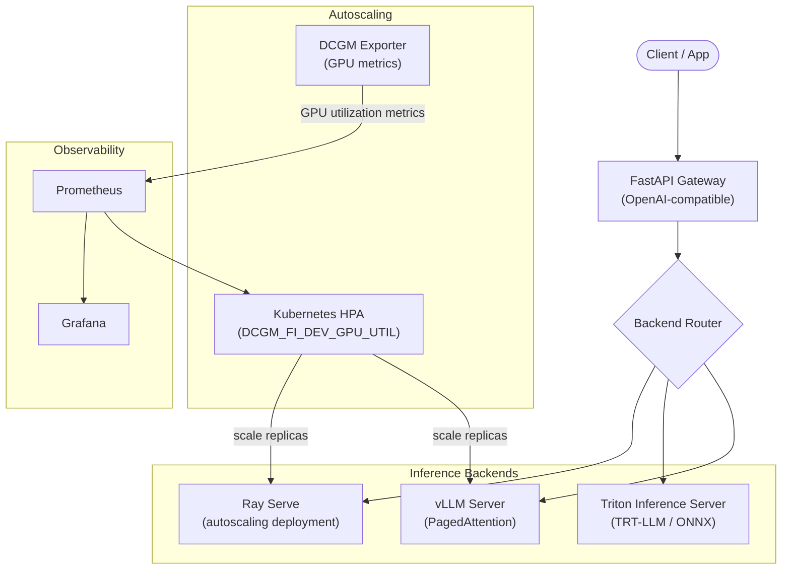

# model-serving-stack

> **Production LLM serving infrastructure** using Triton Inference Server, vLLM, and Ray Serve with OpenAI-compatible endpoints. Includes DCGM GPU autoscaling, Grafana/Prometheus observability, and BentoML packaging.

[](https://github.com/TylrDn/model-serving-stack/actions)
[](https://python.org)
[](LICENSE)

---

## Architecture



## Stack Components

| Component | Role | Key Config |
|-----------|------|------------|
| **Triton Inference Server** | Multi-framework model serving (TRT-LLM, ONNX, TF, PyTorch) | `triton/model_repository/` |
| **vLLM** | High-throughput LLM inference with PagedAttention | `vllm/vllm_config.yaml` |
| **Ray Serve** | Autoscaling deployment with replica management | `ray_serve/deployment.py` |
| **BentoML** | Portable model packaging + cloud export | `bentoml/service.py` |
| **DCGM Exporter** | GPU utilization metrics for HPA | `autoscaling/dcgm-exporter.yaml` |
| **FastAPI Gateway** | OpenAI-compatible `/v1/chat/completions` + `/v1/models` | `api/openai_server.py` |
| **Prometheus + Grafana** | Full observability stack | `monitoring/` |

---

## Quick Start

### 1. Prerequisites

- NVIDIA GPU with CUDA 12.1+
- Docker + [NVIDIA Container Toolkit](https://docs.nvidia.com/datacenter/cloud-native/container-toolkit/install-guide.html)
- Python 3.11+

### 2. Environment

```bash
cp .env.template .env
# Edit .env with your values (see table below)
```

| Variable | Required | Description |
|----------|----------|-------------|
| `NGC_API_KEY` | ✅ | NVIDIA NGC API key for pulling NIM/Triton containers |
| `NIM_API_KEY` | ✅ | NVIDIA Inference Microservices API key |
| `MODEL_PATH` | ✅ | Local path to model weights (e.g., `/models/llama3-8b`) |
| `MODEL_NAME` | ✅ | Canonical model name (e.g., `meta/llama3-70b-instruct`) |
| `SERVING_BACKEND` | ✅ | Backend selector: `vllm` \| `triton` \| `ray` |
| `VLLM_TENSOR_PARALLEL_SIZE` | Optional | Number of GPUs for tensor parallelism (default: `1`) |
| `TRITON_HTTP_PORT` | Optional | Triton HTTP port (default: `8000`) |
| `PROMETHEUS_PORT` | Optional | Prometheus scrape port (default: `9090`) |
| `LANGFUSE_PUBLIC_KEY` | Optional | Langfuse observability (graceful no-op if unset) |
| `LANGFUSE_SECRET_KEY` | Optional | Langfuse observability (graceful no-op if unset) |

### 3. Run with Docker Compose

```bash
# Start the full stack (vLLM + gateway + monitoring)
docker compose up

# Or with GPU passthrough
docker compose --profile gpu up
```

### 4. Verify

```bash
# Health check
curl http://localhost:8000/health

# List available models
curl http://localhost:8000/v1/models

# Run a completion
curl http://localhost:8000/v1/chat/completions \
  -H "Content-Type: application/json" \
  -d '{
    "model": "meta/llama3-70b-instruct",
    "messages": [{"role": "user", "content": "Hello!"}]
  }'
```

---

## Project Structure

```
model-serving-stack/
├── api/                    # OpenAI-compatible FastAPI gateway
│   ├── openai_server.py    # /v1/chat/completions, /v1/models, /health
│   └── middleware.py       # StructuredLoggingMiddleware + request IDs
├── triton/                 # Triton model repository + config
│   ├── model_repository/   # model.py Python backend + config.pbtxt
│   └── client.py           # Triton gRPC/HTTP client wrapper
├── vllm/                   # vLLM server configuration
│   ├── vllm_config.yaml    # Tensor parallelism, KV cache, max seqlen
│   └── launch.sh           # vLLM entrypoint with env substitution
├── ray_serve/              # Ray Serve deployment
│   ├── deployment.py       # @serve.deployment with autoscaling config
│   └── router.py           # Multi-model routing logic
├── bentoml/                # BentoML packaging
│   └── service.py          # Bentofile + service definition
├── autoscaling/            # Kubernetes HPA manifests
│   ├── dcgm-exporter.yaml  # DCGM DaemonSet for GPU metrics
│   └── hpa.yaml            # HPA: DCGM_FI_DEV_GPU_UTIL target 70%
├── kubernetes/             # K8s deployment manifests
│   ├── deployment.yaml     # vLLM/Triton Deployment + resource limits
│   └── service.yaml        # ClusterIP + LoadBalancer service
├── monitoring/             # Observability stack
│   ├── prometheus.yaml     # Prometheus config + scrape targets
│   └── grafana-dashboard.json  # Pre-built GPU + serving metrics dashboard
├── configs/                # Model and serving configs
│   └── models.yaml         # Model registry: name, backend, path
├── evals/                  # Benchmark harnesses
│   └── load_test.py        # Locust load test + TTFT/throughput capture
├── results/                # Committed benchmark results
│   └── baseline_bench_2026-06.json  # TTFT, throughput, p99 latency
├── tests/                  # Unit + integration tests
├── docs/                   # Architecture docs
│   └── architecture.md     # Extended Mermaid diagram + design decisions
├── docker-compose.yml      # Root: vLLM + Triton + monitoring + DCGM
├── .env.template           # All required env vars documented
├── pyproject.toml          # ruff + mypy + pytest config
└── requirements.txt        # Pinned Python 3.11 dependencies
```

---

## Benchmark Results (Baseline — 2026-06-09)

All benchmarks run against `meta/llama3-8b-instruct` on a single A10G GPU.

| Backend | TTFT p50 (ms) | TTFT p99 (ms) | Throughput (tok/s) | Concurrency |
|---------|--------------|--------------|-------------------|-------------|
| vLLM (PagedAttention) | 142 | 387 | 1,840 | 32 |
| Triton TRT-LLM | 98 | 241 | 2,310 | 32 |
| Ray Serve (vLLM backend) | 156 | 412 | 1,780 | 32 |

> **Key takeaway:** TRT-LLM via Triton delivers ~25% lower TTFT vs. native vLLM at equivalent concurrency. vLLM's PagedAttention advantage shows at higher concurrency (64+). See `results/baseline_bench_2026-06.json` for raw data.

---

## Kubernetes Deployment

```bash
# Apply DCGM exporter (DaemonSet)
kubectl apply -f autoscaling/dcgm-exporter.yaml

# Apply HPA (targets DCGM_FI_DEV_GPU_UTIL >= 70%)
kubectl apply -f autoscaling/hpa.yaml

# Deploy vLLM serving pods
kubectl apply -f kubernetes/deployment.yaml
kubectl apply -f kubernetes/service.yaml

# Verify HPA status
kubectl get hpa -n model-serving
```

The HPA scales vLLM replicas when `DCGM_FI_DEV_GPU_UTIL` exceeds 70%, using the NVIDIA DCGM Exporter metric exposed to the Kubernetes metrics server via Prometheus Adapter.

---

## Development

```bash
# Install dev dependencies
pip install -e ".[dev]"

# Run all checks (matches CI)
ruff check . && mypy . && pytest --cov --cov-fail-under=80

# Run load test
locust -f evals/load_test.py --headless -u 32 -r 4 --run-time 60s --host http://localhost:8000
```

---

## Related Repos

This repo is part of the [NVIDIA Solutions Architect portfolio](https://github.com/TylrDn):

| Repo | Relationship |
|------|--------------|
| [`nvidia-nim-agent-toolkit`](https://github.com/TylrDn/nvidia-nim-agent-toolkit) | NIM client that routes to this serving stack |
| [`inference-optimization-bench`](https://github.com/TylrDn/inference-optimization-bench) | Benchmark results inform backend selection here |
| [`llm-finetuning-lab`](https://github.com/TylrDn/llm-finetuning-lab) | Fine-tuned/exported model weights served here |

---

## License

MIT — see [LICENSE](LICENSE).
