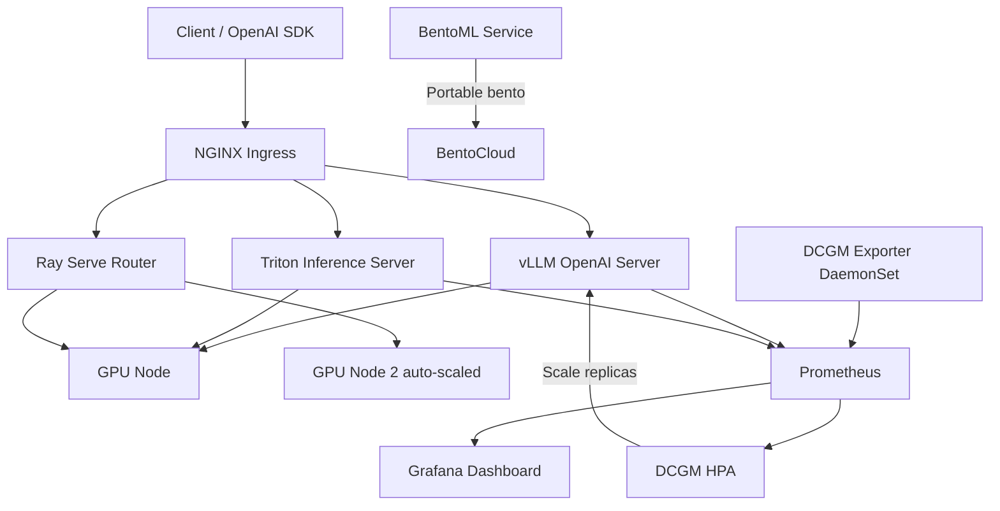

# Architecture — model-serving-stack

## Serving Stack Overview

## Component Roles

| Component | Role |
|---|---|
| Triton Inference Server | NVIDIA-native serving; Python backend wraps vLLM engine |
| vLLM OpenAI Server | Drop-in `/v1/chat/completions`; continuous batching |
| Ray Serve Router | Multi-model A/B routing; replica autoscaling |
| DCGM Exporter | Exposes GPU util, memory, power as Prometheus metrics |
| HPA (DCGM) | Scales vLLM Deployment pods on GPU utilization threshold |
| Grafana Dashboard | Live TTFT, throughput, GPU memory, queue depth |
| BentoML | Portable packaging path — deploy to BentoCloud or any cloud |

## Autoscaling Flow

1. DCGM Exporter DaemonSet scrapes GPU utilization every 15s
2. Prometheus collects `DCGM_FI_DEV_GPU_UTIL` metric
3. Prometheus Adapter exposes metric to K8s metrics API
4. HPA reads metric — if avg GPU util > 70%, scales up vLLM pods
5. Scale-down stabilized over 5 min to prevent thrashing

## Cross-Repo Integration

- Models fine-tuned in [`llm-finetuning-lab`](https://github.com/TylrDn/llm-finetuning-lab) export to GGUF/merged weights
- [`inference-optimization-bench`](https://github.com/TylrDn/inference-optimization-bench) benchmarks against this stack's endpoints
- [`nvidia-nim-agent-toolkit`](https://github.com/TylrDn/nvidia-nim-agent-toolkit) agents route through vLLM's `/v1/chat/completions`
