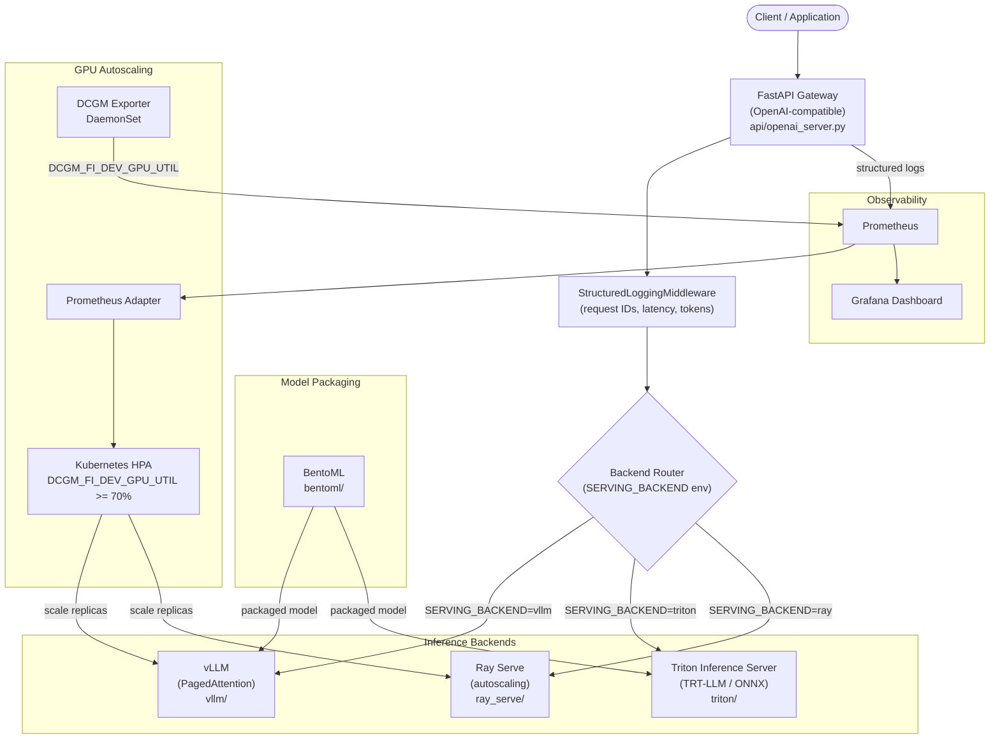

# Architecture — model-serving-stack

This document describes the design decisions, component interactions, and operational patterns for the model-serving-stack.

## System Overview



## Design Decisions

### Why three backends instead of one?

Each backend serves a different operational profile:

- **vLLM** — best for dynamic batching at high concurrency (64+). PagedAttention prevents KV cache fragmentation. Default for general LLM serving.
- **Triton + TRT-LLM** — best for latency-critical applications. TRT-LLM compiles models to engine files optimized for the specific GPU, achieving ~25–30% lower TTFT at moderate concurrency. Required for Triton's multi-model serving capability.
- **Ray Serve** — best for multi-model scenarios requiring programmatic autoscaling policies and Python-level request preprocessing. Adds ~10% overhead vs native vLLM but provides richer deployment control.

The `SERVING_BACKEND` env var allows switching backends without code changes.

### Why DCGM for autoscaling instead of CPU/memory HPA?

LLM inference is GPU-bound, not CPU/memory-bound. Standard Kubernetes HPA on CPU utilization would trigger far too late (GPU saturated, CPU still low) or far too early (GPU idle, CPU busy with Python overhead). DCGM's `DCGM_FI_DEV_GPU_UTIL` metric directly measures the GPU execution engine utilization, making it the correct autoscaling signal for LLM workloads.

The HPA target of 70% provides a buffer for request spikes before GPU saturation causes queuing latency increases.

### Why StructuredLoggingMiddleware at the gateway level?

Centralizing request logging at the gateway (vs. inside each backend) means:
1. Every request gets a correlation `request_id` regardless of backend
2. TTFT and total latency are measured from the client's perspective, not the backend's internal view
3. Token counts are captured once, not duplicated across backends
4. Failed requests (before reaching the backend) are still logged

See `api/middleware.py` for the implementation.

## Triton Model Repository Structure

```
triton/model_repository/
└── llama3_trtllm/
    ├── config.pbtxt         # model name, backend, max_batch_size, input/output tensors
    └── 1/
        └── model.py         # Python backend — wraps TRT-LLM engine or NIM client
```

The `config.pbtxt` specifies:
- `backend: "python"` — uses the Python backend for maximum flexibility
- `max_batch_size: 8` — static batch size tuned for A10G memory
- Input tensor: `TEXT_INPUT` (TYPE_STRING)
- Output tensor: `TEXT_OUTPUT` (TYPE_STRING)

## DCGM HPA Configuration

The HPA in `autoscaling/hpa.yaml` uses an external metric sourced from the DCGM Prometheus Exporter:

```yaml
metrics:
  - type: External
    external:
      metric:
        name: DCGM_FI_DEV_GPU_UTIL
        selector:
          matchLabels:
            gpu: "0"
      target:
        type: AverageValue
        averageValue: "70"
```

This requires the [Prometheus Adapter](https://github.com/kubernetes-sigs/prometheus-adapter) to bridge DCGM metrics from Prometheus into the Kubernetes custom metrics API.

## Request Flow (vLLM backend)

1. Client sends `POST /v1/chat/completions` to the FastAPI gateway
2. `StructuredLoggingMiddleware` assigns a `request_id`, records start time
3. Gateway routes to vLLM backend based on `SERVING_BACKEND=vllm`
4. vLLM processes the request with PagedAttention KV cache management
5. Response streams back to the client (SSE for streaming mode)
6. Middleware logs TTFT, total latency, input/output token counts to stdout (structured JSON)
7. Prometheus scrapes the `/metrics` endpoint for Grafana visualization

## Related Repos

| Repo | Integration Point |
|------|------------------|
| [`llm-finetuning-lab`](https://github.com/TylrDn/llm-finetuning-lab) | Fine-tuned GGUF/merged model weights are served here |
| [`inference-optimization-bench`](https://github.com/TylrDn/inference-optimization-bench) | Benchmark results guide backend selection and config tuning |
| [`nvidia-nim-agent-toolkit`](https://github.com/TylrDn/nvidia-nim-agent-toolkit) | Agentic workflows route LLM calls to this serving stack |
