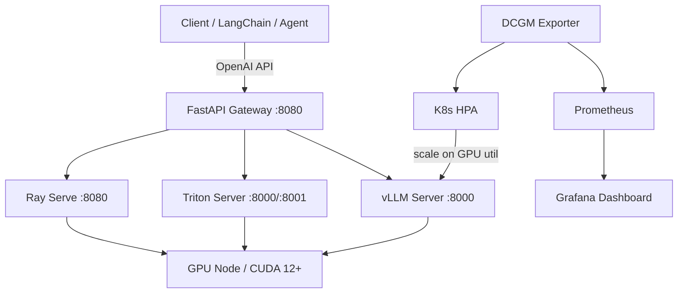

# Architecture — model-serving-stack

## Overview
Production LLM serving stack with three interchangeable backends behind a unified OpenAI-compatible gateway.

## Component Flow

## Backends
| Backend | Best For | Throughput | Latency |
|---|---|---|---|
| vLLM | LLM chat, high throughput | ⭐⭐⭐⭐⭐ | ⭐⭐⭐⭐ |
| Triton | Multi-framework, ONNX, TRT | ⭐⭐⭐⭐ | ⭐⭐⭐⭐⭐ |
| Ray Serve | Autoscaling, multi-model | ⭐⭐⭐⭐ | ⭐⭐⭐ |

## Autoscaling
HPA watches `dcgm_gpu_utilization` via Prometheus adapter. Scales vLLM pods when GPU util exceeds 80%.
